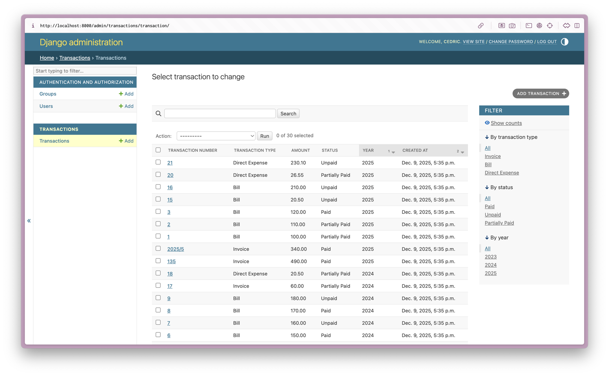

# Transaction API - Case Study

## Prerequisites

- Python 3.13+
- Docker & Docker Compose
- [uv](https://docs.astral.sh/uv/) package manager
- [just](https://just.systems/) command runner (optional but recommended)

## Quick Start

```bash
just setup
just dev
```

## API Documentation

Once the server is running (`just dev`), access the API documentation:

- Swagger UI: http://localhost:8000/api/schema/swagger-ui/
- ReDoc: http://localhost:8000/api/schema/redoc/
- OpenAPI Schema: http://localhost:8000/api/schema/
- Django Admin: http://localhost:8000/admin/
  - Manage transactions (requires superuser: `just superuser`)

## Administration

Create the superuser first.

```shell
just superuser
```

Now, login to [Django Admin](http://localhost:8000/admin/) and you are ready to manage
the transactions on the database level. 



## Future Enhancements

1. Replace hardcoded seed data with [Faker](https://github.com/joke2k/faker) library
2. Cache aggregation results with TTL and invalidation on updates
3. Use Celery for async processing of large requests
4. JWT Authentication
5. Integrate Sentry for error tracking and structured logging with metrics
6. Use environment-specific settings

## TODO

- Fix mypy configuration to work with Django plugin and enable type checking in CI
